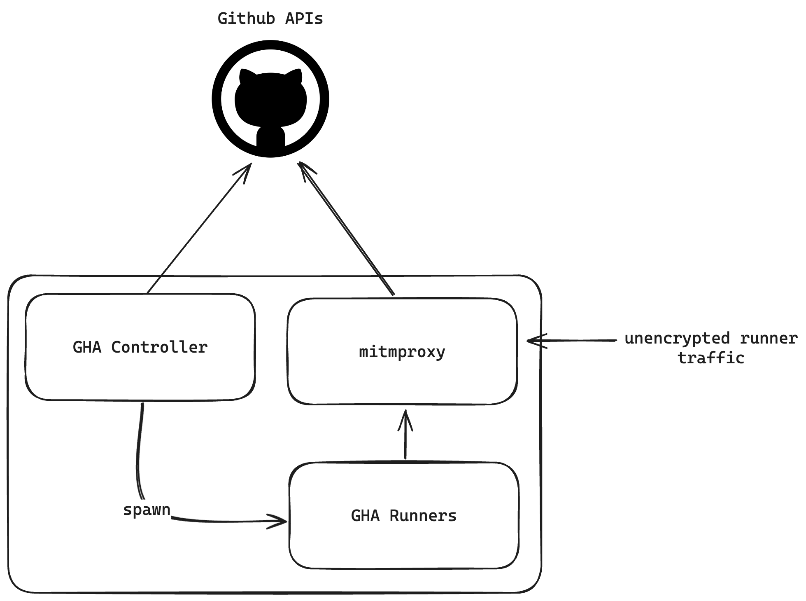

# gha-intercept
A kubernetes deployment to test Github Actions TLS traffic and runner communications

:warning: These are rough notes and aren't meant to be comprehensive. Bringing the cluster up is one thing, but making changes to deployments aren't covered. This could have probably been a gist, but I do plan on coming back to the project and making it more approachable.



## Requirements

You'll need a Github PAT to [manage the ARC deployment](https://docs.github.com/en/actions/hosting-your-own-runners/managing-self-hosted-runners-with-actions-runner-controller/authenticating-to-the-github-api#authenticating-arc-with-a-personal-access-token-classic). 

You'll also need [Helm](https://helm.sh/docs/intro/install/), and [k3s](https://k3s.io/) (other kubernetes clusters will work, but this has only been tested with k3s)

```bash
sudo curl -sfL https://get.k3s.io | sh -
sudo curl https://raw.githubusercontent.com/helm/helm/main/scripts/get-helm-3 | bash
```

## Bringing Up The Cluster

Check out this repo to get the files and run a bit of set up:

```bash
git clone git@github.com:nopcorn/gha-intercept.git
cd gha-intercept
mkdir ~/.kube
sudo cp /etc/rancher/k3s/k3s.yaml ~/.kube/config
sudo chown $USER:$USER ~/.kube/config
export KUBECONFIG=/home/k3s/.kube/config
```

Get the `mitmproxy` pods and services set up and extract the signing certificate for the runners' trust stores.

```bash
kubectl apply -f mitmproxy.yaml
MITMPOD=$(kubectl get pods -n mitmproxy --sort-by=.metadata.creationTimestamp -o name | tail -n1 | cut -d/ -f2)
kubectl cp mitmproxy/"$MITMPOD":/tmp/.mitmproxy/mitmproxy-ca-cert.pem ./mitmproxy-ca.crt
```

Create a namespace for the runners and a configmap that has the mitmproxy certificate.

```bash
kubectl create ns arc-runners
kubectl create configmap mitmproxy-ca-cert --from-file=ca.crt=./mitmproxy-ca.crt --namespace arc-runners
```

Install the `gha-runner-scale-set-controller` and `gha-runner-scale-set` charts to get the controllers set up.

```bash
GITHUB_USER="nopcorn"
GITHUB_REPO="this-doesnt-exist"
GITHUB_PAT="ghp_xxxxxxxxxxxxxxxxxxxxxxx"
KUBE_API="10.43.0.1:443" # will be different on your system, probably

helm install arc \
    --namespace "arc-systems" \
    --create-namespace \
    oci://ghcr.io/actions/actions-runner-controller-charts/gha-runner-scale-set-controller

helm upgrade "arc-runner-set" \
    --namespace "arc-runners" \
    --set githubConfigUrl="https://github.com/$GITHUB_USER/$GITHUB_REPO" \
    --set githubConfigSecret.github_token="$GITHUB_PAT" \
    --set proxy.https.url="http://mitmproxy.mitmproxy.svc.cluster.local:8080" \
    --set "proxy.noProxy[0]=$KUBE_API" \
    -f gha-runner-scale-set.values.yml \
    oci://ghcr.io/actions/actions-runner-controller-charts/gha-runner-scale-set
```

That's it! Assuming everything went well, you should now have the three deployments ready to and traffic from the controller successfully being sent to mitmproxy's proxy port.

# Connecting to the Web Interface

Right now the easiest way to connect to mitmproxy's web interface is by connecting directly from the k3s node. If you're setting this up on a headless server, I'd recommend an SSH tunnel to get your desktop connected.

On the node, get the local IP of the mitmproxy-web service and open a forward tunnel from your desktop:

```bash
# on the node
MITMWEB_IP=$(kubectl get svc -A | grep mitmproxy-web | awk '{print $4}')

# on your desktop
ssh -L 8081:$MITMWEB_IP:8081 user@k3s_node_ip
```

You'll also need the key generated by mitmproxy that will allow you to connect. You can get that by checking the pod logs. This will change between deployments:

```bash
POD_NAME=$(kubectl get pods -n mitmproxy | tail -1 | awk '{print $1}')
kubectl logs $POD_NAME -n mitmproxy
```
